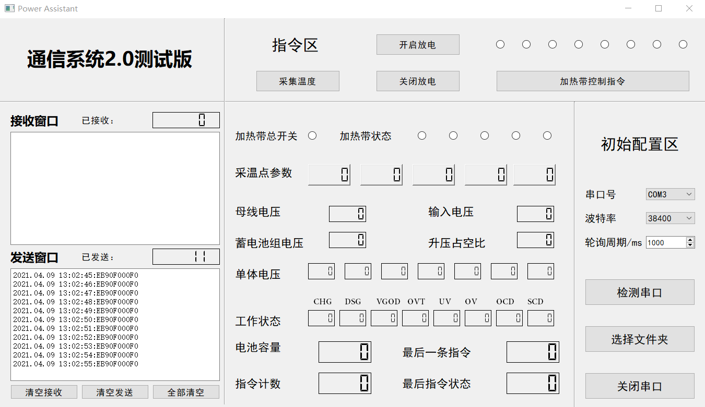

# 基于RS232的C8051F040单片机与PC机通信协议类的设计
注意:请随时参看最新协议类设计

## 中心机命令帧
|序号|字节定义(HEX)|描述|备注|
|--|--|--|--|
|1|EB90|帧头|2 字节 |
|2|Cmd|指令类型|1 字节|
|3|Parameter|指令参数|1 字节|
|4|CheckCode|(指令类型+指令参数)%256校验码|2字节|

## 下位机应答帧
|序号 |字节定义(HEX)| 描述| 备注|
|--|--|--|--|
|1 |EB90| 帧头|2字节 |
|2 |Cmd |节点号|1字节 |
|3 |Parameter| 应答参数| 若干字节|
|4 |CheckCode| (指令计数+接收到的中心机命令+应答参数)%256校验码| 2字节|

## Code
